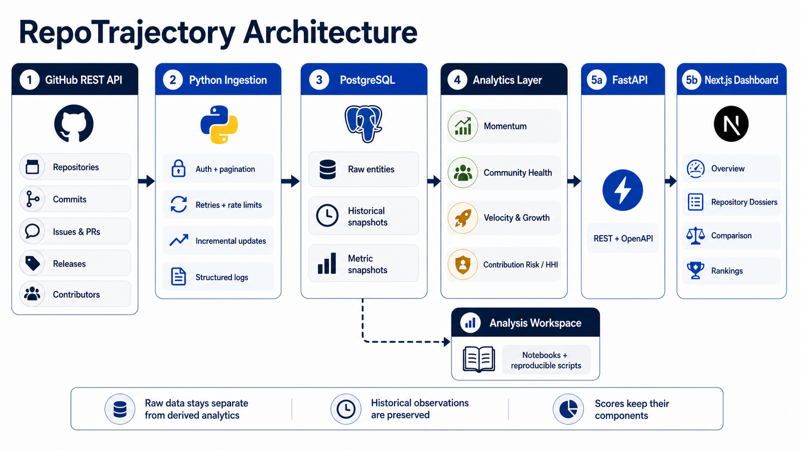
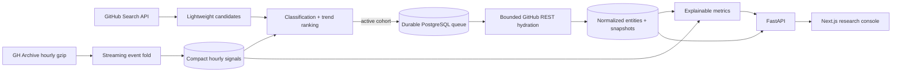

# RepoTrajectory — Repository Intelligence

RepoTrajectory builds an explainable, continuously refreshed evidence base for open-source
software. It combines GitHub REST data with compact GH Archive adoption signals to answer which
repositories are gaining momentum, sustaining healthy delivery, attracting contributors, or
becoming concentrated around a small number of people.

The interface is an institutional research console: portfolio overview, repository directory,
rankings, comparisons, dossiers, methodology governance, and a dedicated **Collection control**
workspace. A deterministic Signal Ledger translates model output into traceable observations.

## Run the complete app

Requirements: Docker with Compose and a read-only GitHub token. After the token is configured once,
there is only one command:

```bash
cp .env.example .env
# Edit .env and replace GITHUB_TOKEN.
./run.sh
```

The launcher checks ports `10100–10110`, reuses the current app port on later runs, starts every
container, waits for the application, and prints the exact links. PostgreSQL and FastAPI remain
inside Docker's private network, so they cannot collide with other host containers.

Example output:

```text
RepoTrajectory is ready.
App:        http://localhost:10100
Collection: http://localhost:10100/collection
API docs:   http://localhost:10100/backend/docs
```

Use `./run.sh down` to stop it and `./run.sh logs` to follow all service logs. The collector stays
running, schedules discovery and refresh work, claims durable PostgreSQL jobs, and safely resumes
after restarts.

## Administration

Open the administration link printed by `./run.sh` to manage ingestion, run the scheduler,
reconcile or reclassify the candidate universe, enqueue maintenance, inspect every queue state,
retry or cancel eligible jobs, and review the privileged-action audit ledger.

To configure or rotate the local operator password without writing plaintext to disk:

```bash
./run.sh admin-password
```

The public Collection screen is observability-only. All mutations require an authenticated,
short-lived HttpOnly session plus session-bound CSRF and strict-origin validation. Only explicit
operations are exposed—there is no browser shell, raw SQL console, or Docker socket. See
[Administration security and operations](docs/administration.md).

## Architecture





The monorepo contains:

- `backend/`: FastAPI, SQLAlchemy, GitHub clients, collector worker, Alembic, and analytics.
- `frontend/`: Next.js, TypeScript, Tailwind, and native SVG charts.
- `analysis/`: a decoupled research workspace.
- `docs/metrics.md`: model definitions and evidence caveats.
- `docs/collector.md`: collection policy, storage, recovery, and scaling details.
- `docs/administration.md`: authentication, command controls, audit, and deployment hardening.

## How automatic collection works

1. GitHub Search contributes established, recently active software across configured languages.
2. GH Archive files are streamed directly from gzip. Raw event payloads are never written to disk
   or PostgreSQL.
3. Each hour is reduced to at most 500 repository counters. Adoption (stars/forks) and
   collaboration (PRs/issues/releases) lead selection; push volume is capped as supporting
   evidence.
4. A transparent metadata classifier withholds obvious lists, courses, roadmaps, and templates
   before expensive hydration. Uncertain GH Archive candidates receive a one-request probe.
5. Seven-day signal percentiles and popularity select the active cohort. Missing signals stay
   missing or provisional rather than receiving neutral score credit.
6. A PostgreSQL queue leases work with `FOR UPDATE SKIP LOCKED`, retries transient failures with
   backoff, reclaims expired leases, and delays GitHub work until rate limits reset.
7. Hydration is bounded and incremental. The first run has time and item ceilings; later runs use
   resource watermarks and daily snapshots.

Default policy discovers up to 2,000 candidates, promotes 250 active repositories, scans six
lagged GH Archive hours, and refreshes active repositories every 24 hours. Every limit is
configurable in `.env`.

## Development setup

The one-command Docker path is recommended. For backend development, expose only PostgreSQL on the
dedicated development port 15432, then run the processes separately:

```bash
docker compose -f docker-compose.yml -f docker-compose.dev.yml up -d postgres

cd backend
python -m venv .venv
source .venv/bin/activate
pip install -e '.[dev]'
alembic upgrade head
uvicorn app.main:app --reload --port 8001
```

```bash
cd backend
source .venv/bin/activate
python -m app.cli collector
```

```bash
cd frontend
npm install
npm run dev
```

The development frontend automatically proxies `/backend` to `http://localhost:8001`, matching the
API command above.

## Operations commands

Run these from `backend/` with the virtual environment active:

```bash
python -m app.cli schedule                 # enqueue all due work
python -m app.cli collector                # continuous scheduler + worker
python -m app.cli collector --once         # process one job and exit
python -m app.cli collector-status         # queue, archive, and rate summary
python -m app.cli enqueue fastapi/fastapi  # manually pin one repository
python -m app.cli classify-candidates      # reapply transparent eligibility rules
```

Manual one-off ingestion remains available:

```bash
python -m app.cli ingest fastapi/fastapi
python -m app.cli ingest-config ../repositories.yml
```

## Token permissions

For public repositories, use the least-privileged read-only token possible. Do not grant workflow,
packages, organization administration, hooks, user write, or repository deletion permissions.
RepoTrajectory only performs GET requests. Private repositories require explicitly selected
repository access and read-only contents/metadata; public-only collection does not need broad
`repo` scope. The token is loaded only by backend services and is never sent to the browser.

## Data and scoring

Momentum blends observed adoption, growth coverage, and activity acceleration rather than raw
volume. Health combines human contributor breadth, resolved-event cycle time, PR acceptance,
stable releases, and recent human work. Contributor concentration uses recent human commits and
exposes top-one/top-three share, HHI, and effective contributor count. Known bot activity is
reported separately.

Every metric snapshot stores components, sample sizes, coverage, methodology version, and a
deterministic assessment. See [the methodology](docs/metrics.md).

## Tests and quality

```bash
cd backend
PYTEST_DISABLE_PLUGIN_AUTOLOAD=1 pytest -p pytest_asyncio.plugin
ruff check app tests alembic/versions
mypy app

cd ../frontend
npm run build

cd ..
docker compose config --quiet
```

## Current evidence limits

- Historical star growth begins with the first recurring snapshot; GitHub REST cannot recreate it.
- Cycle time is not first-response or review latency.
- Commits are default-branch observations and identity matching is imperfect.
- Pull-request additions/deletions and CI reliability need additional detail endpoints.
- Trend confidence improves as more GH Archive hours and snapshots accumulate.
- The metadata classifier is an explainable intake heuristic, not a semantic guarantee; manual
  pinning remains available for edge cases.
