# Software Discovery Backend Architecture & Taxonomy Redesign

## 1. Overview and Design Goals

RepoTrajectory began with eight narrow AI-specific categories that covered fewer than 1% of catalogued repositories. This redesign establishes RepoTrajectory as a broad, scalable software discovery platform across core software engineering domains, with an additive, paginated API contract that enables independent frontend development and future taxonomy expansion.

### Core Objectives
- **Broad Coverage**: Expand software discovery across 8 core parent categories and 36 subtopics, treating AI & Machine Learning as one equal category among Web, Backend, Databases, DevOps, Developer Tools, Security, and Mobile/Desktop.
- **Explainable, Precise Matching**: Replace rigid, naive substring matching with exact GitHub topic alias sets and safe multi-word description phrases, preventing false-positive inflation (e.g. "storage" matching "rag" or "therapeutic" matching "api").
- **Additive API Contract**: Expose `GET /api/v2/topics` and `GET /api/v2/topics/{slug}` with deterministic cursor pagination, search (`q`), language filtering, pre-filter language facets, and exact repository counts.
- **Backward Compatibility**: Preserve all 8 legacy topic slugs (`agent-frameworks`, `rag`, `evaluation`, `observability`, `model-serving`, `vector-search`, `mcp-tooling`, `ai-infrastructure`) as children under `ai-machine-learning`.
- **Read-Only Public Requests**: Public reads never trigger external GitHub requests, background tasks, or database mutations.
- **High Performance**: Use deduplicated SQL queries, in-memory count caching with TTL, and deterministic identity tie-breakers.

---

## 2. Investigation Findings: Causes of Sparse Results

A comprehensive audit of the local production database (`github_analysis-postgres-1`) identified three distinct causes for sparse results in the initial implementation:

```
+-----------------------------------------------------------------------------+
|                               Catalog Snapshot                              |
+------------------------------------+----------------------------------------+
| Metric                             | Measured Count (Local Production DB)   |
+------------------------------------+----------------------------------------+
| Total Ingestion Candidates         | 41,369                                 |
| Canonical Catalog Repositories     | 34,474                                 |
| Repositories with Primary Language | 2,769 (8.0%)                           |
| Repositories with Descriptions     | 2,517 (7.3%)                           |
| Repositories with Topics           | 1,843 (5.3%)                           |
| Repositories with Stars > 0        | 2,584 (7.5%)                           |
| Repositories with Zero Metadata    | 31,709 (92.0%)                         |
| Unique Repos in Old 8 AI Topics    | 184 (0.53% of catalog)                 |
| Directory Tier Members             | 2,070                                  |
| Deep Cohort Members                | 633                                    |
+------------------------------------+----------------------------------------+
```

### Breakdown by Category

#### A. Repositories Absent or Incomplete in Catalog (Metadata Stubs)
- **31,709 catalog rows (92.0%)** entered the database via hourly GH Archive event ingestion (`provenance.source = 'gh_archive'`). GH Archive events only provide `{id, full_name}`, leaving `description`, `topics`, `primary_language`, and `stars` unpopulated until probed.
- Discovery search was historically configured for only 6 programming languages (`Python, TypeScript, JavaScript, Go, Rust, Java`) capped at 200 repositories per language, without category-driven search.

#### B. Repositories Missed by Topic Matching
- **Zero coverage for general software**: The catalog contained zero topics for Web, Backend & APIs, Databases, DevOps, Developer Tools, Security, or Mobile/Desktop.
- **Brittle keyword terms**:
  - `agent-frameworks` specified `["agent-framework", "multi-agent", "agentic"]`, missing 135 repositories tagged with `ai-agents`, 64 tagged with `ai-agent`, 59 tagged with `agent`, and 52 tagged with `agents`.
  - `rag` specified `["retrieval-augmented", "rag-framework", "rag-pipeline"]`, matching only 3 repositories while missing 84 repositories tagged with `rag` or `retrieval-augmented-generation`.
  - `mcp-tooling` missed 121 repositories tagged with `mcp`.
- In total, **99.47%** of catalog repositories were unmapped to any topic.

#### C. Results Hidden by Hardcoded Limits
- `topic_projects()` enforced a hardcoded `.limit(60)`, hiding matching repositories beyond 60 (e.g. `agent-frameworks` had 74 matching repos; `mcp-tooling` had 64).
- Neither cursor pagination nor search/filter parameters existed on `/api/v2/topics/{slug}`.
- An extraneous release-feed query on `RepositoryChangeEvent` executed on every topic detail request, adding database load without user-facing value.

---

## 3. Two-Level Software Taxonomy Architecture

The taxonomy organizes software development into 8 top-level parent categories and 36 focused child subtopics.

### Hierarchy & Slug Mapping

```mermaid
graph TD
    Root["Software Discovery Taxonomy"]
    Root --> Web["web (Web)"]
    Root --> Backend["backend-apis (Backend & APIs)"]
    Root --> Data["data-databases (Data & Databases)"]
    Root --> Infra["infrastructure-devops (Infrastructure & DevOps)"]
    Root --> DevTools["developer-tools (Developer Tools)"]
    Root --> Sec["security (Security)"]
    Root --> Mobile["mobile-desktop (Mobile & Desktop)"]
    Root --> AI["ai-machine-learning (AI & Machine Learning)"]

    Web --> W1["frontend-frameworks"]
    Web --> W2["fullstack-frameworks"]
    Web --> W3["ui-components"]
    Web --> W4["state-management"]

    Backend --> B1["api-frameworks"]
    Backend --> B2["rpc-graphql"]
    Backend --> B3["async-messaging"]
    Backend --> B4["api-gateways"]

    Data --> D1["relational-databases"]
    Data --> D2["nosql-cache"]
    Data --> D3["data-pipelines"]
    Data --> D4["database-tooling"]

    Infra --> I1["containers-orchestration"]
    Infra --> I2["infrastructure-as-code"]
    Infra --> I3["ci-cd"]
    Infra --> I4["service-networking"]

    DevTools --> T1["cli-terminal"]
    DevTools --> T2["compilers-build"]
    DevTools --> T3["testing-qa"]
    DevTools --> T4["debugging-profiling"]

    Sec --> S1["auth-identity"]
    Sec --> S2["cryptography"]
    Sec --> S3["vulnerability-scanner"]
    Sec --> S4["network-security"]

    Mobile --> M1["cross-platform"]
    Mobile --> M2["ios-development"]
    Mobile --> M3["android-development"]
    Mobile --> M4["desktop-apps"]

    AI --> L1["agent-frameworks (legacy)"]
    AI --> L2["rag (legacy)"]
    AI --> L3["evaluation (legacy)"]
    AI --> L4["observability (legacy)"]
    AI --> L5["model-serving (legacy)"]
    AI --> L6["vector-search (legacy)"]
    AI --> L7["mcp-tooling (legacy)"]
    AI --> L8["ai-infrastructure (legacy)"]
```



### Complete Taxonomy Specification

| Parent Slug | Parent Name | Subtopic Slug | Subtopic Name | Aliases & Phrases Sample |
| :--- | :--- | :--- | :--- | :--- |
| `web` | Web | `frontend-frameworks` | Frontend Frameworks | `react`, `vue`, `angular`, `svelte`, `solidjs`, `ui-framework` |
| `web` | Web | `fullstack-frameworks` | Fullstack & SSR | `nextjs`, `remix`, `nuxt`, `sveltekit`, `astro`, `ssr` |
| `web` | Web | `ui-components` | UI & Design Systems | `tailwind`, `tailwindcss`, `radix-ui`, `shadcn`, `design-system` |
| `web` | Web | `state-management` | State & Client Utilities | `state-management`, `redux`, `zustand`, `wasm`, `webrtc` |
| `backend-apis` | Backend & APIs | `api-frameworks` | API & Microframeworks | `fastapi`, `express`, `django`, `flask`, `spring-boot`, `gin`, `nestjs` |
| `backend-apis` | Backend & APIs | `rpc-graphql` | RPC & GraphQL | `graphql`, `grpc`, `protobuf`, `trpc`, `rpc`, `openapi` |
| `backend-apis` | Backend & APIs | `async-messaging` | Message Queues & Streaming | `kafka`, `rabbitmq`, `celery`, `event-driven`, `pubsub`, `nats` |
| `backend-apis` | Backend & APIs | `api-gateways` | API Gateways & Edge | `api-gateway`, `reverse-proxy`, `rate-limiting`, `envoy`, `traefik` |
| `data-databases` | Data & Databases | `relational-databases` | Relational Databases | `postgresql`, `postgres`, `mysql`, `sqlite`, `sql`, `rdbms` |
| `data-databases` | Data & Databases | `nosql-cache` | NoSQL & In-Memory | `redis`, `mongodb`, `cassandra`, `scylladb`, `key-value`, `cache` |
| `data-databases` | Data & Databases | `data-pipelines` | Data Pipelines & ETL | `etl`, `spark`, `flink`, `airflow`, `data-engineering`, `pipeline` |
| `data-databases` | Data & Databases | `database-tooling` | ORMs & Database Tooling | `orm`, `prisma`, `sqlalchemy`, `migrations`, `query-builder` |
| `infrastructure-devops` | Infrastructure & DevOps | `containers-orchestration` | Containers & Orchestration | `kubernetes`, `k8s`, `docker`, `containers`, `podman`, `helm` |
| `infrastructure-devops` | Infrastructure & DevOps | `infrastructure-as-code` | Infrastructure as Code | `terraform`, `ansible`, `opentofu`, `pulumi`, `iac` |
| `infrastructure-devops` | Infrastructure & DevOps | `ci-cd` | CI/CD & Automation | `ci-cd`, `github-actions`, `continuous-integration` |
| `infrastructure-devops` | Infrastructure & DevOps | `service-networking` | Service Mesh & Networking | `service-mesh`, `networking`, `dns`, `wireguard`, `proxy` |
| `developer-tools` | Developer Tools | `cli-terminal` | CLI & Terminal | `cli`, `command-line`, `terminal`, `tui` |
| `developer-tools` | Developer Tools | `compilers-build` | Compilers & Build Systems | `compiler`, `bundler`, `transpiler`, `build-tool`, `linter` |
| `developer-tools` | Developer Tools | `testing-qa` | Testing & QA | `testing`, `test-framework`, `unit-test`, `jest`, `pytest`, `cypress` |
| `developer-tools` | Developer Tools | `debugging-profiling` | Debugging & Profiling | `debugger`, `profiler`, `profiling`, `tracing`, `benchmarking` |
| `security` | Security | `auth-identity` | Auth & Identity | `authentication`, `authorization`, `oauth`, `jwt`, `identity` |
| `security` | Security | `cryptography` | Cryptography & Encryption | `cryptography`, `encryption`, `crypto`, `zero-knowledge`, `zkp` |
| `security` | Security | `vulnerability-scanner` | Vulnerability & AppSec | `vulnerability-scanner`, `secrets-detection`, `appsec`, `sast` |
| `security` | Security | `network-security` | Network & Perimeter | `firewall`, `intrusion-detection`, `network-security`, `waf` |
| `mobile-desktop` | Mobile & Desktop | `cross-platform` | Cross-Platform | `flutter`, `react-native`, `electron`, `tauri`, `cross-platform` |
| `mobile-desktop` | Mobile & Desktop | `ios-development` | iOS & Apple | `ios`, `swift`, `swiftui`, `macos` |
| `mobile-desktop` | Mobile & Desktop | `android-development` | Android | `android`, `kotlin`, `jetpack-compose`, `android-development` |
| `mobile-desktop` | Mobile & Desktop | `desktop-apps` | Desktop Applications | `desktop`, `windows-app`, `linux-desktop`, `gtk`, `qt` |
| `ai-machine-learning` | AI & Machine Learning | `agent-frameworks` *(legacy)* | AI Agent Frameworks | `agent-framework`, `multi-agent`, `agentic`, `ai-agents`, `ai-agent` |
| `ai-machine-learning` | AI & Machine Learning | `rag` *(legacy)* | RAG Infrastructure | `retrieval-augmented`, `rag-framework`, `rag-pipeline`, `rag` |
| `ai-machine-learning` | AI & Machine Learning | `evaluation` *(legacy)* | AI Evaluation | `llm-evaluation`, `ai-evaluation`, `evals`, `model-evaluation` |
| `ai-machine-learning` | AI & Machine Learning | `observability` *(legacy)* | AI Observability | `llm-observability`, `llm-monitoring`, `llm-tracing` |
| `ai-machine-learning` | AI & Machine Learning | `model-serving` *(legacy)* | Model Serving / Inference | `model-serving`, `inference-server`, `llm-inference`, `vllm` |
| `ai-machine-learning` | AI & Machine Learning | `vector-search` *(legacy)* | Vector & Search Infrastructure | `vector-database`, `vector-search`, `search-engine`, `vectordb` |
| `ai-machine-learning` | AI & Machine Learning | `mcp-tooling` *(legacy)* | MCP / Agent Tooling | `model-context-protocol`, `mcp-server`, `mcp-client`, `mcp` |
| `ai-machine-learning` | AI & Machine Learning | `ai-infrastructure` *(legacy)* | Developer AI Infrastructure | `llm-framework`, `llm-gateway`, `ai-infrastructure`, `llm` |

### Structural Properties
1. **Deduplicated Parent Union**:
   A repository belongs to a parent category if and only if it matches at least one of the parent's child subtopics:
   $$\text{Matches}(\text{Parent}) = \bigcup_{c \in \text{Children}} \text{Matches}(c)$$
   The parent's `repository_count` and paginated `projects` are deduplicated in SQL (`SELECT count(DISTINCT github_id)`), ensuring a repository matching multiple children is counted and listed exactly once.
2. **Multi-Topic Membership**:
   Repositories naturally belong to all topics they match (e.g. an AI-powered vector database matches both `vector-search` under AI and `nosql-cache` under Databases).

---

## 4. Precise Matching & False-Positive Prevention

Indiscriminate substring matching inflates results with irrelevant tools (for instance, matching "rag" inside "storage" or "courage", or matching "api" inside "therapeutic").

### Matching Rules
1. **Exact GitHub Topic Tag Matching**:
   In `catalog_repositories`, GitHub topics are stored as a JSON array of strings (`["react", "nextjs"]`).
   Matching uses:
   ```python
   cast(CatalogRepository.topics, String).ilike(f'%"{term}"%')
   ```
   Because elements in the JSON array are quoted (`"rag"`), this matches `"rag"` exactly and will never match `"courage"` or `"storage"`.
2. **Safe Description Phrase Matching**:
   Description text searches only match multi-word phrases (e.g. `"agent framework"`, `"retrieval augmented"`, `"vector database"`, `"rest api"`). Single short acronyms (e.g. `"rag"`, `"mcp"`, `"cli"`, `"sql"`) are excluded from raw substring matching in descriptions.
3. **Curation Hooks**:
   Explainable inclusion/exclusion dictionaries (`INCLUDE[slug]` and `EXCLUDE[slug]`) allow pin-pointing explicit repositories without distorting matching rules.

---

## 5. Additive API Contract

### 1. `GET /api/v2/topics`

Returns the full two-level taxonomy.

#### Schema
```typescript
interface TopicResponseItem {
  slug: string;
  name: string;
  description: string;
  terms: string[];
  parent_slug: string | null;
  repository_count: number;
}
```

#### Example Response
```json
[
  {
    "slug": "web",
    "name": "Web",
    "description": "Frontend frameworks, fullstack frameworks, UI primitives, and web runtimes.",
    "terms": ["web", "frontend", "fullstack", "ui", "browser"],
    "parent_slug": null,
    "repository_count": 542
  },
  {
    "slug": "frontend-frameworks",
    "name": "Frontend Frameworks",
    "description": "UI component libraries, reactive frameworks, and web view layers.",
    "terms": ["react", "vue", "angular", "svelte", "solidjs", "frontend", "ui-framework", "web-framework", "preact", "lit"],
    "parent_slug": "web",
    "repository_count": 218
  },
  {
    "slug": "agent-frameworks",
    "name": "AI Agent Frameworks",
    "description": "Build and coordinate software agents.",
    "terms": ["agent-framework", "multi-agent", "agentic", "ai-agents", "ai-agent", "autonomous-agents", "llm-agent", "agent-frameworks"],
    "parent_slug": "ai-machine-learning",
    "repository_count": 142
  }
]
```

### 2. `GET /api/v2/topics/{slug}`

Paginated, searchable, and filterable endpoint for any topic (parent or child).

#### Query Parameters
| Parameter | Type | Default | Description |
| :--- | :--- | :--- | :--- |
| `q` | `string \| null` | `null` | Free-text search matching name, description, or topics |
| `language` | `string \| null` | `null` | Exact or case-insensitive primary language filter |
| `sort` | `relevance \| stars \| updated` | `relevance` | Sort ordering |
| `cursor` | `string \| null` | `null` | Opaque base64 pagination cursor bound to query context |
| `limit` | `integer` (1-100) | `30` | Number of repositories per page |

#### Response Schema
```typescript
interface TopicDetailResponse {
  topic: TopicResponseItem;
  projects: TopicProject[];
  limit: number;
  total_count: number;
  next_cursor: string | null;
  languages: Array<{ value: string; count: number }>;
  changes: [];
}

interface TopicProject {
  github_id: number;
  full_name: string;
  description: string | null;
  primary_language: string | null;
  matched_terms: string[];
  pushed_at: string | null;
  stars: number;
}
```

#### Field Semantics
- `total_count`: Count of matching repositories **after** applying `q` and `language` filters.
- `languages`: Language facets computed across `topic + q` matches **before** the `language` filter is applied (enabling UI dropdowns to show available language distributions).
- `next_cursor`: Base64-encoded token containing the query context and the last repository’s sort values and ID. Set to `null` on the last page.
- `changes`: Empty list `[]` maintained for backward compatibility (the expensive `RepositoryChangeEvent` table scan was removed).

#### Cursor Validation & Context Binding
Cursors encode their search context:
```json
{"v": 2, "slug": "web", "q": "react", "lang": "TypeScript", "sort": "stars", "id": 123, "stars": 500, "score": 50.0, "pushed": null}
```
If a client attempts to reuse a cursor across a different topic, sort order, or filter parameter, the server rejects it with `400 Bad Request` (`"Cursor context does not match request filters"`). Malformed base64 or invalid JSON is similarly rejected with `400 Bad Request`.

#### Deterministic Sorting & Identity Tie-Breaker
- `relevance`: `selection_score DESC, stars DESC, github_id ASC`
- `stars`: `stars DESC, github_id ASC`
- `updated`: `pushed_at DESC NULLS LAST, github_id ASC`

Every sort order terminates with `github_id ASC`. Keyset continuation avoids offsets shifting when earlier rows are inserted or deleted. Results are a live view, not a frozen snapshot: changing a repository’s sort values can still move it between pages. Cursors are validated navigation data, not signed security tokens; older offset cursors must restart at the first page.

---

## 6. Background Discovery & Collection Broadening

Background discovery was broadened from a fixed 6-language probe to a category-driven discovery pipeline.

### Changes Made to Collection
1. **Multi-Category Discovery Jobs**:
   `CollectorScheduler.tick` enqueues durable, deduplicated daily discovery jobs for key software category topics:
   `frontend`, `fullstack`, `api`, `graphql`, `database`, `redis`, `devops`, `kubernetes`, `cli`, `compiler`, `security`, `cryptography`, `cross-platform`, `mobile`, `agentic`, `rag`.
2. **Durable Deduplication**:
   All jobs use daily deduplication keys:
   ```python
   f"discover:github:topic:{topic_slug}:{day_key}"
   ```
   Ensures exactly one collection job per topic per day.
3. **Rate Limit & Quota Safety**:
   - Discovery batch limits respect `settings.discovery_results_per_language`.
   - The GitHub client rate limiter and reserve (`github_rate_limit_reserve = 100`) prevent exhaustion.
   - Live public requests **never** trigger collection or external network calls.

---

## 7. Verification & Test Suite

The test suite covers both unit logic and API integration:

```bash
uv run --python 3.12 pytest
```

### Test Coverage Highlights (`tests/test_discovery_redesign.py`)
- `test_taxonomy_hierarchy_and_legacy_slugs`: Validates parent slugs (`parent_slug: null`), child slugs, and backward compatibility for all 8 legacy slugs.
- `test_precise_matching_and_false_positive_avoidance`: Verifies that `"rag"` matches RAG repositories while ignoring "storage" and "courage", and that "therapeutic" does not match API frameworks.
- `test_parent_deduplicated_union_and_counts`: Verifies that a repository matching multiple children appears only once in parent queries and counts.
- `test_filters_languages_facets_and_search`: Verifies `q` text search, `language` filtering, and pre-filter language facet computation.
- `test_sorting_deterministic_ties_and_cursor_pagination`: Verifies stable cursor pagination and deterministic identity tie-breaking.
- `test_cursor_validation_and_tampering`: Verifies that corrupted or context-mismatched cursors return `400 Bad Request`.
- `test_public_reads_make_zero_external_requests`: Verifies with network mocking (`respx`) that public endpoints execute zero outbound HTTP requests.

All 60 test cases pass with zero regressions.

---

## 8. Rollout, Verification & Backfill Commands

### Verification Commands
```bash
# 1. Inspect taxonomy overview
curl -s http://localhost:10100/backend/api/v2/topics | jq '.[0:5]'

# 2. Browse parent topic (Web) with pagination
curl -s "http://localhost:10100/backend/api/v2/topics/web?limit=5" | jq '{topic: .topic.name, count: .total_count, projects: [.projects[].full_name]}'

# 3. Browse legacy slug (agent-frameworks)
curl -s "http://localhost:10100/backend/api/v2/topics/agent-frameworks" | jq '{topic: .topic.name, parent: .topic.parent_slug, count: .total_count}'

# 4. Search and filter by language with facets
curl -s "http://localhost:10100/backend/api/v2/topics/data-databases?q=sql&language=Rust" | jq '{total: .total_count, languages: .languages, projects: [.projects[].full_name]}'
```

### Backfill & Scheduled Collection
```bash
# Enqueue discovery tick manually via collector CLI
python -m app.cli schedule

# Reconcile directory selection
python -m app.cli reconcile-directory
```

## Integration fixes

Topic counts refresh through one conditional aggregate query instead of 44 separate
queries. A process-local lock prevents overlapping refreshes. Successful counts
are cached for five minutes; database failures retain the last successful counts
and retry after 30 seconds. A cold cache propagates failure instead of inventing zeros.
Search terms and language filters treat SQL wildcard characters literally.

The metadata audit above is the previous agent’s measured snapshot, not a fresh
measurement during integration. Broader discovery adds bounded daily search jobs;
it does not bulk-fill the existing metadata backlog. No migration is required.

Category/language search results now update the canonical catalog and search
documents in the same transaction as candidate discovery. This reuses metadata
already returned by GitHub, adds no HTTP requests, and preserves deep-analysis
links, ranking, and README evidence. Existing stubs encountered by search gain
metadata immediately. Category jobs run before directory reconciliation. The
remaining unseen stub backlog still requires future collection; it is not bulk
hydrated by this change.
